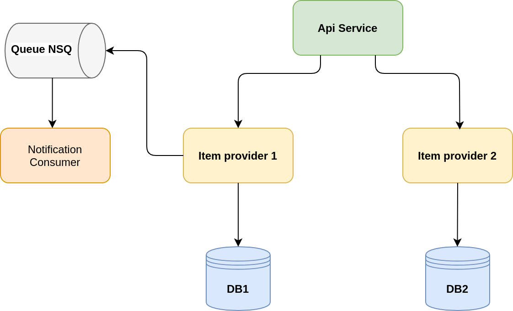

# tracing-demo

OpenTelemetry demo projects supports shows ability of tracing using auto-instrumentation feature.

# Architecture diagram


# Run
## Jaeger, Zipkin
```
make jaeger-zipkin-up
```
## New Relic
For new relic integration API key should be provided.
API key should be set in Makefile in NEW_RELIC_API_KEY variable 
```
make jaeger-zipkin-up
```

# Endpoint
- API: http://localhost:8081

